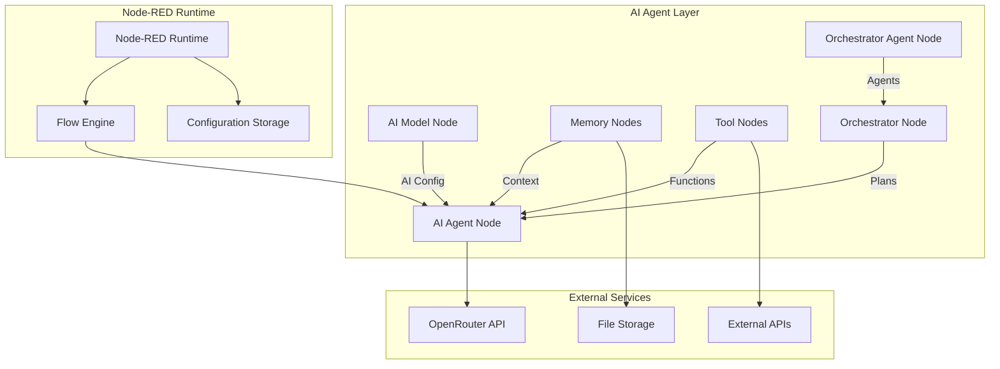

# Architecture

This document describes the system architecture, design patterns, and key technical decisions behind the Node-RED AI Agent.

## System Overview

The Node-RED AI Agent follows a modular, event-driven architecture that integrates with Node-RED's flow-based programming model. The system is designed around the principles of separation of concerns, statelessness, and extensibility.

## Core Architecture



## Design Principles

### 1. Separation of Concerns

Each node type has a single, well-defined responsibility:

- **AI Model**: API configuration and authentication
- **AI Agent**: Core AI processing and conversation management
- **Memory**: Context storage and retrieval
- **Tools**: Extensible functionality
- **Orchestrator Agent**: Discovers and registers team capabilities, exposes zero-wire execution API
- **Orchestrator**: Multi-agent coordination

### 2. Stateless Design

Memory configurations are stateless by design:

- Configuration nodes define behavior, not state
- Runtime state is managed through message passing
- Enables horizontal scaling and reliability
- Simplifies testing and debugging

### 3. Message-Driven Architecture

All communication happens through Node-RED messages:

- `msg.aiagent`: AI configuration and model settings
- `msg.aimemory`: Memory context and configuration
- `msg.aiagent.tools`: Available tool definitions
- `msg.payload`: User input and AI responses

### 4. Extensibility

The tool system allows for unlimited extension:

- Standardized tool interface
- Dynamic tool registration
- Template variable support
- Error handling and validation

## Component Architecture

### AI Agent Node

The AI Agent is the central processing component:

```javascript
// Core processing flow
function processMessage(node, msg) {
  // 1. Validate configuration
  validateConfig(msg.aiagent);
  
  // 2. Prepare prompt with context
  const prompt = preparePrompt(node, msg, inputText);
  
  // 3. Execute AI call
  const response = await callAI(prompt, msg.aiagent.tools);
  
  // 4. Handle tool calls
  if (response.tool_calls) {
    const toolResults = await executeTools(response.tool_calls);
    // Continue conversation with tool results
  }
  
  // 5. Update memory
  if (msg.aimemory) {
    await updateMemory(msg.aimemory, conversation);
  }
  
  // 6. Send response
  send(response);
}
```

### Memory System

Memory nodes use a configuration pattern:

```javascript
// Memory configuration interface
const memoryConfig = {
  type: 'in-memory' | 'file',
  maxItems: number,
  persistence: boolean,
  consolidation: {
    enabled: boolean,
    threshold: number,
    model: string
  }
};

// Memory operations
const memoryOperations = {
  add: (conversationId, message) => Promise<void>,
  get: (conversationId, limit?) => Promise<Message[]>,
  search: (query) => Promise<Message[]>,
  consolidate: (conversationId) => Promise<void>
};
```

### Tool System

Tools follow a standardized interface:

```javascript
// Tool definition schema
const toolDefinition = {
  name: string,
  description: string,
  parameters: {
    type: 'object',
    properties: Record<string, ParameterSchema>,
    required: string[]
  }
};

// Tool execution interface
const toolExecutor = {
  execute: (input: any) => Promise<any>,
  validate: (input: any) => boolean,
  format: (result: any) => any
};
```

## Data Flow Patterns

### 1. Simple Processing Flow

```
Input → Model Config → Agent Processing → Output
```

### 2. Memory-Enhanced Flow

```
Input → Model Config → Memory Context → Agent Processing → Memory Update → Output
```

### 3. Tool-Enhanced Flow

```
Input → Model Config → Tool Registration → Agent Processing → Tool Execution → Output
```

### 4. Orchestrated Flow

```
Input → Model Config → Orchestrator Agent Discovery → Orchestrator Planning → Zero-Wire Agent Execution → Result Reflection → Next Task
```

## Key Technical Decisions

### 1. OpenRouter Integration

**Decision**: Use OpenRouter as the primary AI model gateway

**Rationale**:
- Single API key for multiple models
- Model-agnostic interface
- Cost optimization through model selection
- Future-proofing for new model releases

### 2. Memory Configuration Pattern

**Decision**: Separate memory configuration from storage implementation

**Rationale**:
- Enables multiple storage backends
- Simplifies testing with mock implementations
- Allows runtime storage selection
- Reduces node complexity

### 3. Tool Registration via Message Passing

**Decision**: Register tools through `msg.aiagent.tools` array

**Rationale**:
- Leverages Node-RED's message system
- Enables dynamic tool composition
- Simplifies debugging and tracing
- Supports conditional tool inclusion

### 4. Chain Discovery Manifests

**Decision**: Use AI Orchestrator Agent nodes to build `msg.agents` manifests in-line.

**Rationale**:
- Maintains visual clarity in Node-RED flows
- Scopes teams per orchestrator without extra config panels
- Allows orchestrator to validate capabilities before planning
- Enables zero-wire execution by keeping node IDs readily available

### 4. Stateless Memory Nodes

**Decision**: Memory nodes are configuration-only, not stateful

**Rationale**:
- Improves reliability and restart behavior
- Enables memory sharing between agents
- Simplifies deployment and scaling
- Reduces memory leak potential

## Performance Considerations

### Token Management

- Automatic context length management
- Configurable retention policies
- Conversation consolidation for long histories
- Template variable optimization

### Memory Efficiency

- Lazy loading of conversation history
- Configurable memory limits
- Background consolidation processes
- Efficient serialization formats

### Network Optimization

- Request batching where possible
- Timeout and retry strategies
- Connection pooling for HTTP tools
- Caching for repeated requests

## Security Architecture

### API Key Management

- Node-RED credential storage integration
- Environment variable support
- Runtime key validation
- Secure transmission to external APIs

### Input Validation

- Schema validation for tool parameters
- Template variable sanitization
- Message size limits
- Content type verification

### Error Handling

- Graceful degradation for API failures
- Error propagation through message system
- Detailed logging without exposing sensitive data
- Recovery strategies for network issues

## Testing Architecture

### Unit Testing

- Mock external dependencies
- Isolated component testing
- Message flow validation
- Error scenario coverage

### Integration Testing

- End-to-end flow testing
- Real API integration (with test keys)
- Memory persistence validation
- Tool execution verification

### Performance Testing

- Load testing for high-volume scenarios
- Memory usage profiling
- Response time benchmarking
- Concurrent execution testing

## See Also

- [Data Flow](data_flow.md) - Detailed message processing flow
- [API Reference](api_reference.md) - Complete API documentation
- [Module Documentation](modules/) - Individual component details
- [Development](development.md) - Development guidelines and practices
