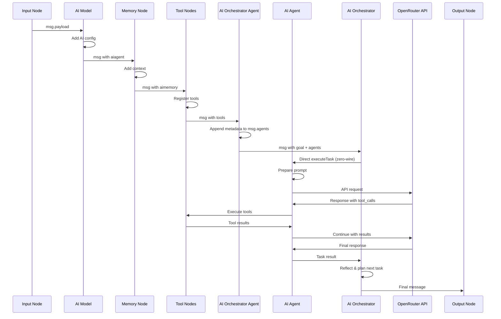

# Data Flow

This document describes how data moves through the Node-RED AI Agent system, including message transformation, context management, and tool execution.

## Message Lifecycle

### 1. Input Message

The flow begins with a standard Node-RED message:

```javascript
{
  "payload": "User input text",
  "topic": "optional-topic",
  "_msgid": "node-red-message-id"
}
```

### 2. AI Model Configuration

The AI Model node adds configuration to the message:

```javascript
{
  "payload": "User input text",
  "topic": "optional-topic",
  "_msgid": "node-red-message-id",
  "aiagent": {
    "model": "gpt-4",
    "apiKey": "sk-or-v1-...",
    "temperature": 0.7,
    "maxTokens": 1000
  }
}
```

### 3. Memory Context (Optional)

Memory nodes add conversation context:

```javascript
{
  "payload": "User input text",
  "topic": "optional-topic",
  "_msgid": "node-red-message-id",
  "aiagent": {
    "model": "gpt-4",
    "apiKey": "sk-or-v1-...",
    "temperature": 0.7,
    "maxTokens": 1000
  },
  "aimemory": {
    "context": [
      {"role": "user", "content": "Previous message", "timestamp": "..."},
      {"role": "assistant", "content": "Previous response", "timestamp": "..."}
    ],
    "maxItems": 10,
    "conversationId": "conv-123"
  }
}
```

### 4. Tool Registration

Tool nodes add available functions:

```javascript
{
  "payload": "User input text",
  "topic": "optional-topic",
  "_msgid": "node-red-message-id",
  "aiagent": {
    "model": "gpt-4",
    "apiKey": "sk-or-v1-...",
    "temperature": 0.7,
    "maxTokens": 1000,
    "tools": [
      {
        "type": "function",
        "function": {
          "name": "getCurrentTime",
          "description": "Get the current date and time",
          "parameters": {"type": "object", "properties": {}}
        }
      }
    ]
  },
  "aimemory": {
    "context": [...],
    "maxItems": 10,
    "conversationId": "conv-123"
  }
}
```

## AI Agent Processing Flow



## Detailed Processing Steps

### Step 1: Configuration Validation

```javascript
function validateAIConfig(aiagent) {
  if (!aiagent) return 'AI configuration missing';
  if (!aiagent.model) return 'AI model not specified';
  if (!aiagent.apiKey) return 'API key not found';
  return null; // Valid
}
```

### Step 2: Prompt Preparation

```javascript
function preparePrompt(node, msg, inputText) {
  const messages = [{ role: 'system', content: node.systemPrompt }];
  
  // Add conversation context if available
  if (msg.aimemory && msg.aimemory.context) {
    messages.push(...msg.aimemory.context);
  }
  
  // Add current user message
  messages.push({ 
    role: 'user', 
    content: inputText,
    timestamp: new Date().toISOString()
  });
  
  return { messages };
}
```

### Step 3: AI API Call

```javascript
async function callAI(prompt, tools, config) {
  const requestBody = {
    model: config.model,
    messages: prompt.messages,
    temperature: config.temperature,
    max_tokens: config.maxTokens
  };
  
  if (tools && tools.length > 0) {
    requestBody.tools = tools;
    requestBody.tool_choice = 'auto';
  }
  
  const response = await axios.post(
    'https://openrouter.ai/api/v1/chat/completions',
    requestBody,
    {
      headers: {
        'Authorization': `Bearer ${config.apiKey}`,
        'Content-Type': 'application/json'
      }
    }
  );
  
  return response.data;
}
```

### Step 4: Tool Execution

When the AI requests tool calls:

```javascript
async function executeTool(toolCall, availableTools) {
  const tool = availableTools.find(t => t.function.name === toolCall.function.name);
  if (!tool) {
    throw new Error(`Tool ${toolCall.function.name} not found`);
  }
  
  try {
    const result = await tool.execute(JSON.parse(toolCall.function.arguments));
    return {
      tool_call_id: toolCall.id,
      output: JSON.stringify(result)
    };
  } catch (error) {
    return {
      tool_call_id: toolCall.id,
      error: error.message
    };
  }
}
```

### Step 5: Memory Update

```javascript
async function updateMemory(memoryConfig, conversation) {
  // Add user message
  await memoryConfig.add(conversation.id, {
    role: 'user',
    content: conversation.input,
    timestamp: new Date().toISOString()
  });
  
  // Add assistant response
  await memoryConfig.add(conversation.id, {
    role: 'assistant',
    content: conversation.response,
    timestamp: new Date().toISOString()
  });
  
  // Check if consolidation is needed
  if (memoryConfig.consolidation && 
      await memoryConfig.getCount(conversation.id) > memoryConfig.consolidation.threshold) {
    await memoryConfig.consolidate(conversation.id);
  }
}
```

## Tool Execution Patterns

### Function Tools

```javascript
// Tool definition
const timeTool = {
  name: 'getCurrentTime',
  description: 'Get current date and time',
  parameters: { type: 'object', properties: {} },
  execute: async (input) => {
    return {
      currentTime: new Date().toISOString(),
      timestamp: Date.now(),
      timezone: Intl.DateTimeFormat().resolvedOptions().timeZone
    };
  }
};
```

### HTTP Tools

```javascript
// Tool definition with template variables
const weatherTool = {
  name: 'getWeather',
  description: 'Get weather for a city',
  parameters: {
    type: 'object',
    properties: {
      city: { type: 'string', description: 'City name' }
    },
    required: ['city']
  },
  execute: async (input) => {
    const url = `https://api.openweathermap.org/data/2.5/weather?q=${input.city}&appid=${process.env.WEATHER_API_KEY}`;
    const response = await axios.get(url);
    return response.data;
  }
};
```

### Approval Tools

```javascript
// Approval tool that pauses execution
const approvalTool = {
  name: 'requestApproval',
  description: 'Request human approval for an action',
  parameters: {
    type: 'object',
    properties: {
      action: { type: 'string', description: 'Action to approve' },
      details: { type: 'string', description: 'Action details' }
    },
    required: ['action']
  },
  execute: async (input, node) => {
    // Send approval request to second output
    node.send([null, {
      payload: `Please approve: ${input.action}`,
      details: input.details,
      approvalId: generateApprovalId()
    }]);
    
    // Wait for approval response
    return await waitForApproval(approvalId);
  }
};
```

## Error Handling Flow

### Configuration Errors

```
Input → Model → [Missing API Key] → Error Output
```

### Memory Errors

```
Input → Model → Memory → [File Access Error] → Error Output
```

### Tool Execution Errors

```
Input → Model → Tools → Agent → Tool Call → [Tool Error] → Continue with Error Message
```

### API Errors

```
Input → Model → Agent → OpenRouter → [API Error] → Retry → [Still Error] → Error Output
```

## Message Transformation Examples

### Simple Chat Flow

**Input:**
```json
{"payload": "Hello, how are you?"}
```

**After AI Model:**
```json
{
  "payload": "Hello, how are you?",
  "aiagent": {
    "model": "gpt-4",
    "apiKey": "sk-or-v1-...",
    "temperature": 0.7,
    "maxTokens": 1000
  }
}
```

**Output:**
```json
{
  "payload": "I'm doing well, thank you for asking! How can I help you today?",
  "aiagent": {
    "model": "gpt-4",
    "apiKey": "sk-or-v1-...",
    "temperature": 0.7,
    "maxTokens": 1000
  }
}
```

### Tool-Enhanced Flow

**Input:**
```json
{"payload": "What time is it?"}
```

**After Tools:**
```json
{
  "payload": "What time is it?",
  "aiagent": {
    "model": "gpt-4",
    "apiKey": "sk-or-v1-...",
    "temperature": 0.7,
    "maxTokens": 1000,
    "tools": [
      {
        "type": "function",
        "function": {
          "name": "getCurrentTime",
          "description": "Get the current date and time",
          "parameters": {"type": "object", "properties": {}}
        }
      }
    ]
  }
}
```

**AI Response (with tool call):**
```json
{
  "choices": [{
    "message": {
      "content": null,
      "tool_calls": [{
        "id": "call_123",
        "type": "function",
        "function": {
          "name": "getCurrentTime",
          "arguments": "{}"
        }
      }]
    }
  }]
}
```

**After Tool Execution:**
```json
{
  "payload": "The current time is 2:30 PM on December 21, 2025.",
  "toolResults": [
    {
      "tool_call_id": "call_123",
      "output": "{\"currentTime\":\"2025-12-21T14:30:00.000Z\"}"
    }
  ]
}
```

## Performance Considerations

### Message Size Management

- Limit conversation context length with `maxItems`
- Consolidate long conversations automatically
- Use efficient JSON serialization
- Monitor message payload sizes

### Tool Execution Optimization

- Cache tool results where appropriate
- Use connection pooling for HTTP tools
- Implement timeout handling for external APIs
- Batch multiple tool calls when possible

### Memory Efficiency

- Use streaming for large conversation histories
- Implement lazy loading of old messages
- Compress stored conversations
- Clean up expired data automatically

## See Also

- [Architecture](architecture.md) - System architecture overview
- [API Reference](api_reference.md) - Complete API documentation
- [Module Documentation](modules/) - Individual component details
- [Troubleshooting](troubleshooting.md) - Common data flow issues
