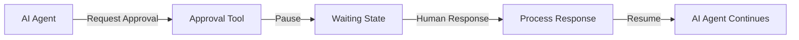

# AI Tool Approval Module

The AI Tool Approval node enables human-in-the-loop workflows by allowing AI agents to request human approval or intervention at specific points in their processing.

## Purpose and Responsibilities

The Tool Approval node serves as a tool definition node that:

- **Approval Requests**: Pauses AI agent execution to request human input
- **Workflow Integration**: Integrates human approval into automated workflows
- **State Management**: Maintains agent state during approval waiting periods
- **Response Handling**: Processes human responses and resumes agent execution

## Key Types and Interfaces

### Tool Definition
```javascript
{
  name: "string",                        // Tool identifier (unique)
  description: "string",                 // Tool description for AI
  question: "string",                    // Question to ask human
  options: "array",                      // Optional response options
  required: "boolean",                   // Whether approval is required
  timeout: "number",                     // Approval timeout in milliseconds
  context: "object"                      // Additional context for human
}
```

### Approval Request Structure
```javascript
{
  approvalId: "string",                  // Unique approval identifier
  question: "string",                    // Question for human
  options: ["string"],                   // Available response options
  required: "boolean",                   // Whether response is required
  context: "object",                     // Additional context
  timestamp: "number",                   // Request timestamp
  agentState: "object"                   // Agent execution state
}
```

### Response Structure
```javascript
{
  approvalId: "string",                  // Matching approval identifier
  response: "string",                    // Human response
  approved: "boolean",                   // Whether approved
  timestamp: "number",                   // Response timestamp
  metadata: "object"                     // Additional response metadata
}
```

## Dependencies and Relationships

### Required Dependencies
- **Node-RED Runtime**: Version 1.0.0 or higher
- **AI Agent Node**: Consumes the tool definition
- **Human Interface**: Some method for humans to respond (UI, API, etc.)

### Integration Points
- **AI Agent Node**: Tool registration and execution
- **Dashboard Nodes**: UI for human approval
- **Notification Systems**: Alert humans of approval requests
- **External Systems**: Integration with approval workflows

## Configuration Options

### Basic Configuration
- **Name**: Display name for the node
- **Tool Name**: Unique identifier used by AI to call the tool
- **Description**: Human-readable description of tool functionality

### Approval Configuration
- **Question**: Default question to ask (can be overridden by AI)
- **Response Options**: Predefined response choices (optional)
- **Required**: Whether approval is mandatory (default: true)

### Advanced Options
- **Timeout**: Approval timeout in milliseconds (default: 300000)
- **Retry Count**: Number of approval retries (default: 3)
- **Escalation**: Escalation behavior on timeout

## Usage Examples

### Simple Approval Request
```javascript
// Configuration
{
  name: "Payment Approval",
  toolName: "requestPaymentApproval",
  description: "Request human approval for payment processing",
  question: "Do you approve this payment of ${input.amount} to ${input.recipient}?",
  required: true
}

// AI Input
{
  amount: "$1,250.00",
  recipient: "Vendor Corp",
  invoice: "INV-2025-123"
}

// Approval Request Sent to Output 2
{
  payload: "Do you approve this payment of $1,250.00 to Vendor Corp?",
  approvalId: "approval-abc123",
  context: {
    amount: "$1,250.00",
    recipient: "Vendor Corp",
    invoice: "INV-2025-123"
  }
}
```

### Multiple Choice Approval
```javascript
// Configuration
{
  name: "Action Selection",
  toolName: "selectAction",
  description: "Request human selection from multiple options",
  question: "Which action should be taken for ${input.issue}?",
  options: ["Approve", "Reject", "Request More Info", "Escalate"],
  required: true
}

// AI Input
{
  issue: "unusual login pattern",
  user: "john.doe@example.com",
  risk: "medium"
}

// Approval Request
{
  payload: "Which action should be taken for unusual login pattern?",
  approvalId: "approval-def456",
  options: ["Approve", "Reject", "Request More Info", "Escalate"],
  context: {
    issue: "unusual login pattern",
    user: "john.doe@example.com",
    risk: "medium"
  }
}
```

### Critical Operation Approval
```javascript
// Configuration
{
  name: "Critical System Change",
  toolName: "requestSystemChangeApproval",
  description: "Request approval for critical system modifications",
  question: "CRITICAL: Approve system change: ${input.change}. This action cannot be undone.",
  required: true,
  timeout: 600000
}

// AI Input
{
  change: "Delete production database backup older than 30 days",
  impact: "Data loss",
  rollback: "Not possible"
}

// Approval Request
{
  payload: "CRITICAL: Approve system change: Delete production database backup older than 30 days. This action cannot be undone.",
  approvalId: "approval-ghi789",
  critical: true,
  timeout: 600000,
  context: {
    change: "Delete production database backup older than 30 days",
    impact: "Data loss",
    rollback: "Not possible"
  }
}
```

## Workflow Integration

### Basic Approval Flow


### Multi-Stage Approval
```javascript
// Stage 1: Initial Review
{
  toolName: "initialReview",
  question: "Does this request meet basic criteria?",
  options: ["Yes", "No", "Needs More Info"]
}

// Stage 2: Detailed Review (if approved)
{
  toolName: "detailedReview",
  question: "Approve detailed implementation?",
  options: ["Approve", "Reject", "Modify"]
}

// Stage 3: Final Approval
{
  toolName: "finalApproval",
  question: "Final approval for ${input.action}?",
  required: true
}
```

### Escalation Workflow
```javascript
// Level 1: Team Lead Approval
{
  toolName: "teamLeadApproval",
  question: "Team lead approval needed for ${input.request}",
  timeout: 300000,
  escalation: {
    onTimeout: "escalateToManager",
    maxRetries: 2
  }
}

// Level 2: Manager Approval (escalated)
{
  toolName: "managerApproval",
  question: "Manager approval: ${input.request} (escalated from team)",
  timeout: 600000,
  escalation: {
    onTimeout: "escalateToDirector",
    maxRetries: 1
  }
}
```

## Response Handling

### Response Processing
```javascript
// Human response input
msg.approvalId = "approval-abc123";
msg.response = "Approved";
msg.approved = true;
msg.metadata = {
  responder: "john.doe",
  timestamp: Date.now(),
  comments: "Looks good to proceed"
};
```

### Response Validation
```javascript
function validateResponse(approvalRequest, response) {
  // Check approval ID matches
  if (response.approvalId !== approvalRequest.approvalId) {
    throw new Error('Approval ID mismatch');
  }
  
  // Check if response is valid option
  if (approvalRequest.options && 
      !approvalRequest.options.includes(response.response)) {
    throw new Error('Invalid response option');
  }
  
  // Check if approval was provided when required
  if (approvalRequest.required && !response.approved) {
    throw new Error('Required approval not provided');
  }
}
```

### Response Formats
```javascript
// Simple boolean response
{ approved: true, response: "Yes" }

// Multiple choice response
{ approved: true, response: "Approve", optionIndex: 0 }

// Response with comments
{ 
  approved: false, 
  response: "Reject", 
  comments: "Need more documentation" 
}

// Conditional approval
{ 
  approved: true, 
  response: "Approve with conditions",
  conditions: ["Add monitoring", "Get stakeholder sign-off"]
}
```

## State Management

### Agent State Preservation
```javascript
// State stored during approval wait
{
  agentId: "agent-123",
  executionState: {
    step: 3,
    context: { /* current conversation context */ },
    tools: { /* available tools */ },
    memory: { /* conversation memory */ }
  },
  approvalRequest: {
    approvalId: "approval-abc123",
    question: "Approve this action?",
    timestamp: Date.now()
  }
}
```

### State Recovery
```javascript
// Resume agent execution after approval
function resumeAgentExecution(agentState, approvalResponse) {
  // Restore agent context
  const agent = getAgent(agentState.agentId);
  agent.restoreState(agentState.executionState);
  
  // Process approval response
  agent.processApprovalResponse(approvalResponse);
  
  // Continue execution
  return agent.continueExecution();
}
```

### Timeout Handling
```javascript
// Handle approval timeout
{
  approvalId: "approval-abc123",
  status: "timeout",
  action: "reject", // or "escalate", "retry"
  message: "Approval request timed out after 5 minutes"
}
```

## Security Considerations

### Approval Authentication
```javascript
// Verify responder identity
{
  responder: "john.doe",
  authentication: {
    method: "mfa",
    token: "jwt-token",
    verified: true
  }
}
```

### Audit Trail
```javascript
// Maintain audit log
{
  approvalId: "approval-abc123",
  requester: "ai-agent-123",
  responder: "john.doe",
  request: {
    question: "Approve payment?",
    context: { amount: "$1,250", recipient: "Vendor Corp" },
    timestamp: "2025-12-21T10:30:00Z"
  },
  response: {
    decision: "approved",
    comments: "Verified invoice",
    timestamp: "2025-12-21T10:32:15Z"
  }
}
```

### Access Control
```javascript
// Role-based approval permissions
{
  approvalType: "financial",
  requiredRole: "finance-manager",
  amountThreshold: 1000,
  escalationRole: "cfo"
}
```

## Performance Optimization

### Approval Caching
```javascript
// Cache similar approval requests
const cacheKey = generateApprovalKey(request);
if (approvalCache.has(cacheKey)) {
  return approvalCache.get(cacheKey);
}
```

### Batch Approvals
```javascript
// Group multiple approval requests
{
  batchId: "batch-123",
  requests: [
    { approvalId: "approval-1", question: "Approve item 1?" },
    { approvalId: "approval-2", question: "Approve item 2?" }
  ],
  batchApproval: true
}
```

### Async Processing
```javascript
// Non-blocking approval handling
async function requestApproval(request) {
  // Send approval request
  await sendApprovalRequest(request);
  
  // Return immediately, don't block
  return { status: "pending", approvalId: request.approvalId };
}
```

## Common Patterns

### Financial Approvals
```javascript
{
  toolName: "approvePayment",
  question: "Approve payment of ${input.amount} to ${input.vendor}?",
  thresholds: {
    autoApprove: 100,
    managerApproval: 1000,
    directorApproval: 10000
  }
}
```

### Security Approvals
```javascript
{
  toolName: "securityApproval",
  question: "Approve security action: ${input.action}?",
  riskLevels: {
    low: { autoApprove: true },
    medium: { requiredApproval: true },
    high: { requiredApproval: true, escalation: true }
  }
}
```

### Change Management
```javascript
{
  toolName: "changeApproval",
  question: "Approve system change: ${input.change}?",
  impactLevels: {
    low: { approvers: ["team-lead"] },
    medium: { approvers: ["team-lead", "manager"] },
    high: { approvers: ["team-lead", "manager", "director"] }
  }
}
```

## Testing and Debugging

### Mock Approval
```javascript
// For testing, auto-approve requests
if (process.env.NODE_ENV === 'test') {
  return { approved: true, response: "Auto-approved (test mode)" };
}
```

### Approval Simulation
```javascript
// Simulate human responses for testing
function simulateApproval(approvalRequest) {
  const responses = ["Approve", "Reject", "Request More Info"];
  return {
    approved: Math.random() > 0.3,
    response: responses[Math.floor(Math.random() * responses.length)]
  };
}
```

### Debug Logging
```javascript
// Log approval requests and responses
console.log(`Approval Request: ${approvalRequest.approvalId}`, {
  question: approvalRequest.question,
  timestamp: approvalRequest.timestamp
});
```

## See Also

- [AI Tool Function Module](ai-tool-function.md) - JavaScript-based tools
- [AI Tool HTTP Module](ai-tool-http.md) - HTTP-based tools
- [AI Agent Module](ai-agent.md) - Tool usage and execution
- [Development Guide](../development.md) - Custom tool development
