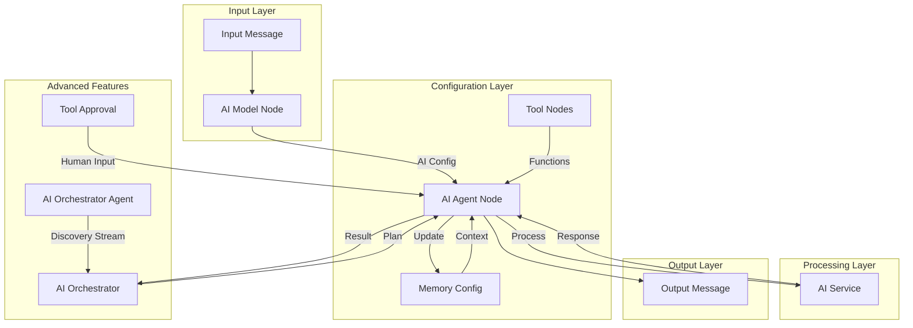

# Overview

The Node-RED AI Agent is a comprehensive framework for integrating AI capabilities into Node-RED flows. It provides a modular, extensible system for building AI-powered automation with conversation context management, tool integration, and multi-agent orchestration.

## System Architecture

## Core Components

### AI Agent Node
The central processing unit that:
- Executes AI model calls with conversation context
- Manages tool execution and response handling
- Maintains conversation flow and state
- Integrates with memory systems for context persistence

### Memory System
Two types of memory configurations:
- **In-Memory**: Volatile storage for temporary conversations
- **File-based**: Persistent storage with backup and consolidation features

### Tool System
Extensible framework for AI agent capabilities:
- **Function Tools**: Custom JavaScript functions
- **HTTP Tools**: External API integration
- **Approval Tools**: Human-in-the-loop workflows

### AI Orchestrator
Advanced multi-agent coordination:
- Autonomous planning and execution
- Task dependency management
- Dynamic plan revision and error recovery

### AI Orchestrator Agent
Discovery-oriented companion node that:
- Tags `msg.agents` with its ID, name, and capabilities as messages flow downstream
- Exposes an `executeTask()` method for zero-wire calls from the Orchestrator
- Provides a simple pipeline output so teams can be composed visually

## Key Design Principles

### Modularity
Each component has a single responsibility and can be used independently or in combination with others.

### Stateless Design
Memory configurations are stateless, making the system more reliable and scalable across multiple instances.

### Extensibility
The tool system allows for unlimited custom functionality while maintaining a consistent interface.

### Context Management
Automatic conversation history management with configurable retention and consolidation strategies.

## Data Flow

1. **Input**: Messages enter through Node-RED input nodes
2. **Configuration**: AI Model node adds API configuration to the message
3. **Memory**: Optional memory nodes provide conversation context
4. **Tools**: Tool nodes register available functions with the agent
5. **Agent Discovery (optional)**: AI Orchestrator Agent nodes append their metadata to `msg.agents`, forming the roster available to orchestrators
6. **Processing**: AI Agent processes the message with full context
7. **Output**: Results are passed to downstream nodes

## Use Cases

### Simple Q&A
Basic question-answering with optional conversation memory.

### API Integration
AI agents that can call external APIs and process responses.

### Multi-Agent Workflows
Complex tasks requiring coordination between multiple specialized agents.

### Human-in-the-Loop
Workflows requiring human approval or intervention at specific points.

## See Also

- [Getting Started](getting_started.md) - Installation and setup
- [Architecture](architecture.md) - Detailed system architecture
- [Data Flow](data_flow.md) - Message processing flow (now including agent discovery)
- [Module Documentation](modules/) - Individual component documentation
